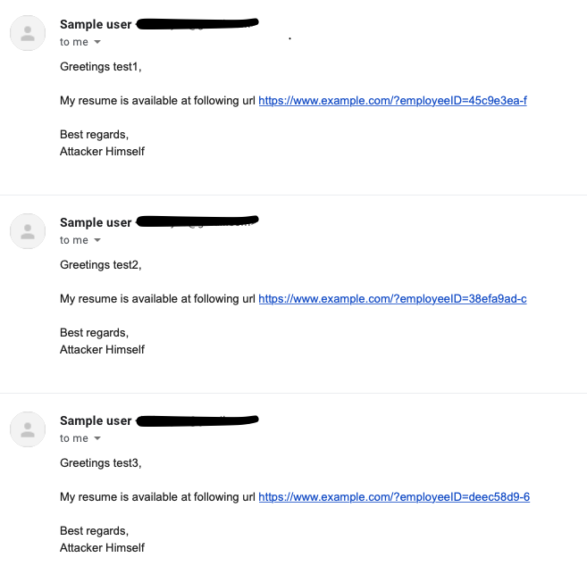

# lateralus

[](https://github.com/lateralusd/lateralus/releases)
[](https://goreportcard.com/report/lateralusd/lateralus)
[](https://pkg.go.dev/github.com/lateralusd/lateralus)

Terminal based phishing campaign tool.

## What is Lateralus and why?

Lateralus is tool built to help with phishing campaigns. It has a lot of customizable report and template injection points for your emails. In the future it will also provide integration with Modlishka result file.

[](https://asciinema.org/a/412559)

## How does it work?
* Run ```lateralus generate -n config.yaml```
* Edit `config.yaml` file to match your needs
* Pass the `config.yaml` to `lateralus run` as `lateralus run -c config.yaml`
* Wait

## Installation

You can install it with: `go get -u github.com/lateralusd/lateralus` or build it from sources by cloning the directory and running the `go build`.

## Tracking server
Lateralus also supports injecting the email with tracking pixel with each mail having its own distinct uuid.

For your own tracking server, you can create the simple web server which will handle get request with `id` as url param or you can use [laserver](https://github.com/lateralusd/laserver). It also supports connecting the lateralus `json` report to see exactly who has opened mail.

## Setting up

### Creating template

In yaml config: `template: `

The first step is to create the email template which you will be sending to your targets. Possible fields inside template are

* {{.Name}} - This will be substituted for target name from .csv file
* {{.Email}} - This will be substituted for target email from .csv file
* {{.URL}} - URL to include inside email
* {{.AttackerName}} - It says it all for itself

Example of template file can be found at `templates/sample.com`:
```
Greetings {{.Name}},

My resume is available at following url {{.URL}}

Best regards,
{{.AttackerName}}
```

### Creating targets

In yaml config: `targets:`

Targets needs to be in .csv format in format _Name_,_Email_ like so:
```
John,john.doe@example.com
Alan,alan.smith@example.com
```

### Choosing URL mode

You have two options for URLs:
* Single - every user get's the same url link ( when the `generate: False` inside the config file)
* Generate - every user get's different url, with the part \<CHANGE\> inside `link:` being present (when the `generate: True` inside the config file)

You also have an option to provide the length of the generated part, by default it will be 10 characters long. (Configurable via `length:` in config file).

#### Example

After we have configured our `.yaml` config file let's run it now.

```bash
$ cat config.yaml
url:
  generate: True
  link: "https://www.google.com/?ident=<CHANGE>"
  length: 10
  
mail:
  name: Attacker
  from: Not Attacker
  subject: Not phishing mail
  custom: ""
  
attack:
  targets: targets.csv
  template: /path/to/your/template/file
  signature: /path/to/your/signature
  
mailServer:
  host: smtp.gmail.com
  port: 587
  username: "someusername@gmail.com"
  password: "somePassword"
  encryption: tls

general:
  bulk: False
  bulkDelay: 60
  bulkSize: 3
  delay: 5
  separator: ","
```

__NOTE:__ If you don't provide template path, `templates/sample` will be used. If you want to include signature in your emails, provide the path in `signature` inside config file.


## Example run

**Template:**
```
Greetings {{.Name}},

My resume is available at following url {{.URL}}

Best regards,
{{.AttackerName}}
```

**Targets file**:
```
test,test@gmail.com
test1,test@gmail.com
test2,test@gmail.com
```

### Running

```bash
$ lateralus run -c config.yaml
[INFO] Starting campaign at 2021-05-07 11:40:16
[INFO] Template not provided, using default template
[INFO] Output not provided, will use default output (Subject_startTime)
[INFO] Parsing config from "config.yaml"
[INFO] Output filename will be "Notphishingmail_2021-05-0711:40:16"
[INFO] Parsing targets from "targets.csv"
[INFO] Starting to send the mails. Hope for the best
Sending mails: 2 / 3 [===============================================================================>_______________________________________] 1 mail/s 66.67%
```

If we check inbox of user test@gmail.com, we can see that email has been sent.



## Config options

## Why lateralus as a name
I really love that album.
